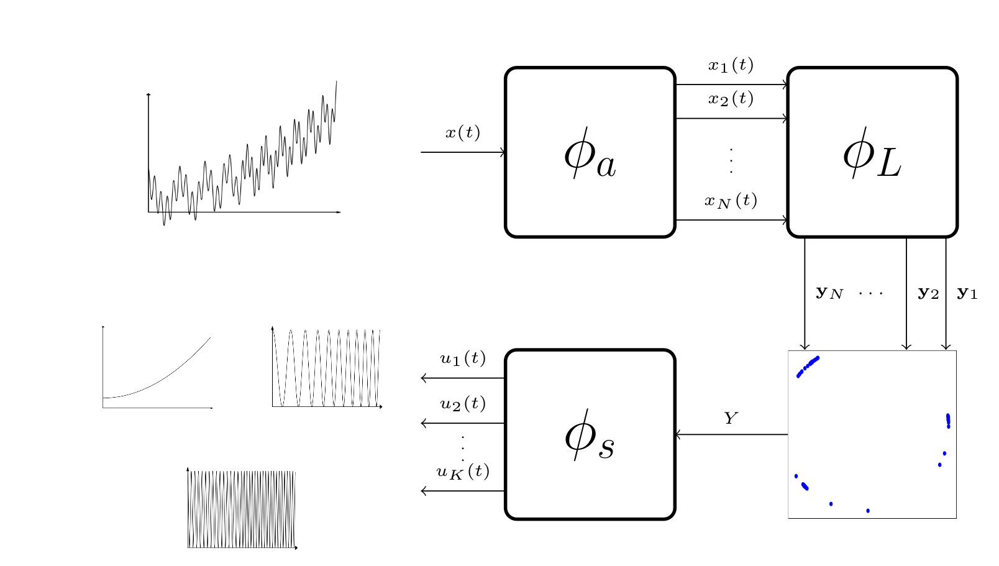

## **Maximal Spectral Overlap Wavelet Transform**

***

Official python implementation of the _Maximal Spectral Overlap Wavelet Transform (MSO-WT)_ 
as described in [(Evangelidis and Kugiumtzis, 2023)](https://ieeexplore.ieee.org/document/10109867). 
The algorithm decomposes a signal into orthogonal _Intrinsic Mode Functions (IMFs)_ each oscillating 
around a different central frequency. 

### Installation

***
1. Install from source <br> <pre><code>$ git clone https://github.com/apostolosev/MSO_WT & cd MSO_WT
$ pip install .</pre></code>


### Minimal Example 

***
```python
import numpy as np
import matplotlib.pyplot as plt
from mso_wt import MSOWT

# Define the example multi-component input sign
t = np.linspace(0.0, 1.0, 1024)
gt_imf1 = 1 / (1.2 + np.cos(2 * np.pi * t))
gt_imf2 = np.cos(32 * np.pi * t + 0.2 * np.cos(64 * np.pi * t)) / (1.5 + np.sin(2 * np.pi * t))
sig = gt_imf1 + gt_imf2

# Decompose the signal using the MSO-WT
msowt = MSOWT(nIMFs=2)
imfs = msowt.decompose(sig)

# Display the decomposition results
# Original signal
plt.figure(figsize=(6, 4))
plt.plot(t, sig, "-k", linewidth=1.5, label="GT-IMF_1 + GT-IMF_2")
plt.title("Multi-component signal")
plt.legend(loc="upper left")
plt.xlabel("Time (s)")

# IMF 1
fig, axs = plt.subplots(1, 2, figsize=(12, 4))
axs[0].plot(t, gt_imf1, "-k", linewidth=1.5, label="GT-IMF_1")
axs[0].plot(t, imfs[0, :], "-c", linewidth=1.5, label="IMF_1")
axs[0].legend(loc="upper left")
axs[0].set_xlabel("Time (s)")

# IMF 2
axs[1].plot(t, gt_imf2, "-k", linewidth=1.5, label="GT-IMF_2")
axs[1].plot(t, imfs[1, :], "-c", linewidth=1.5, label="IMF_2")
axs[1].legend(loc="upper left")
axs[1].set_xlabel("Time (s)")
plt.show()
```

### Citation

***
If you use this package, please cite it as below.
```
@article{evangelidis2023adaptive,
  title={Adaptive Decomposition of Multicomponent Signals and Estimation of Phase Synchronization},
  author={Evangelidis, Apostolos and Kugiumtzis, Dimitris},
  journal={IEEE Transactions on Signal Processing},
  year={2023},
  publisher={IEEE}
}
```

### Licence

*** 
The software is released under the [MIT](https://github.com/apostolosev/MSO_WT/blob/main/license.txt) licence.
